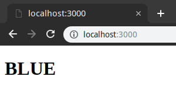
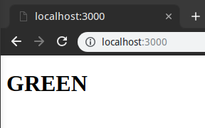

# PM2 Blue/Green Deployment Demo w/ Nuxt.js

This repo demonstrates:

- How to deploy Nuxt.js 2.3.4 via PM2 using cluster mode and `nuxt-start` (faster than `nuxt start` and let's you put `nuxt` in devDependencies)
- How to execute a simple blue/green symlink strategy
- How to perform zero-downtime reloads between blue and green
  - ~~Including a hard to find fix for those using max 2 instances. PM2 reloads 2 instances at a time by default, have to use `PM2_CONCURRENT_ACTIONS=1` to avoid downtime!~~ **UPDATE:** This is reportedly fixed in PM2 3.2.3 https://github.com/Unitech/pm2/pull/4053

### Requirements

- Bash (Tested on 4.4.23)
- Yarn (Tested on 1.12.3)
- PM2 (Tested on 3.2.2)

If you want to use npm you will have to update the scripts, sorry!

**install pm2 globally:**

```bash
yarn global add pm2
```

### Instructions

:warning: **Only run the bash scripts from the project root, the scripts rely on relative paths to function.**

```bash
cd /path/to/pm2-nuxt-blue-green-deploy
bash install.sh # Install npm packages & build nuxt for the blue & green
bash start.sh   # Initialize symlink with blue deployment, and start PM2
bash deploy.sh  # Deploy the the next color and reload PM2
bash stop.sh    # Stop PM2 and remove "current" symlink
```

After running `start.sh`, you should see the blue deployment:



Then, run `deploy.sh` and you will see green deployment:


